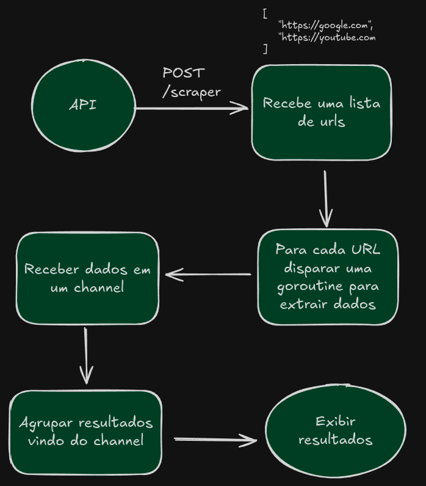

# Web Scraper Concorrente

Projeto de estudo para comparar scraping síncrono vs concorrente em Go, usando Echo Framework e goroutines.
A ideia é mostrar como a concorrência melhora o tempo de resposta em cenários de I/O bloqueante (ex.: páginas lentas).

## Tecnologias
- Golang
- Echo Framework
- Goroutines + Channels + sync.WaitGroup
- Docker

## Fluxo desenhado no excalidraw


## Como Executar
```bash
  git clone git@github.com:EduardoMark/web-scraper-concurrent.git
  cd web-scraper-concurrent
```
Adicione o arquivo .env na raiz do projeto e crie a variável "SERVER_PORT=3000"

Inicie o serviço
```bash
  docker compose up -d
```

## Testes

Execute todos os testes:
```bash
  cd internal/scraper
  go test -v
```

Exemplo de saída:
```bash
  === RUN   TestHandlerConcurrent
  --- PASS: TestHandlerConcurrent (5.66s)
  === RUN   TestHandlerSynchronous
  --- PASS: TestHandlerSynchronous (19.28s)
  PASS
```

## Exemplos de uso 
### POST /scraper (concorrente)

```json
  {
  "urls": [
    "https://www.example.com/",
    "https://httpbin.org/delay/2",
    "https://httpbin.org/status/404"
    ]
  }
```

### POST /scraper/synchronous
Mesmo input, mas executa de forma sequencial.

## Objetivo

- Praticar concorrência em Go com goroutines.
- Comparar desempenho síncrono vs concorrente.
- Criar testes de handlers usando httptest + Echo.
